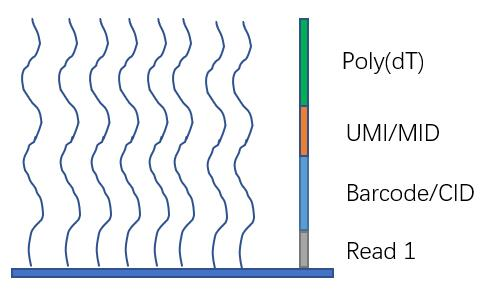

Analysis
========

Analysis represents a collection of STOmics data. It should contain spatial positions, gene expression matrices, visualized images, cell annotation, etc.

Spatial Positions
-----------------

Spatial coordinate index data,  contains Spatial Barcode/Coordinate Identity (CID) and it's position coordinate.

Gene Expression Information
---------------------------

Gene expression information is usually given in the form of matrix, which records the number of UMIs/MIDs associated with a feature and a barcode/CID.

Visualization Images
--------------------

There are a series of images for tissue detection, for example,

* brightfield or fluorescence images acquired by imaging system,
* registered microscopic image,
* downsampled versions of the original, full-resolution image.

Cell Annotation
---------------

Cell idetification and segmentation performed to define each cell population based on marker genes, cell morphology, etc.

Other Downstream Analysis Data
------------------------------

Data sets generated by downstream analysis such as maker identification, cluster annotation, differential expression, etc. Scripts are also included.
