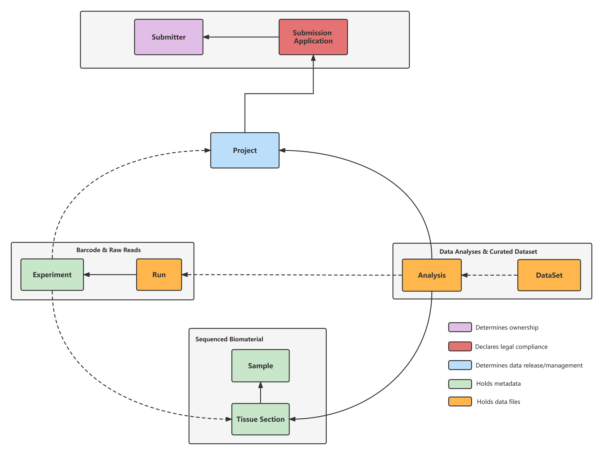

Metadata Model
==============

Submissions are represented using a number of different metadata objects. Before submitting STOmics data, it is important to familiarise yourself with the metadata model. This will determine what you need to submit.

* Submitter: A person who owns the data.
* Submission Application: Legal compliance statement of your data.
* Project: A project groups together submitted data and controls its management. A project accession is typically used when citing submitted data.
* Sample: A sample contains information about the sequenced source material. Samples are always associated with a taxonomy.
* Tissue Section: A tissue section represents a slice cyosectioned from the sample.
* Experiment: An experiment contains information about a sequencing experiment including library and instrument details.
* Run: A run is part of an experiment and refers to data files containing sequence reads.
* Analysis: An anlysis contains secondary analysis results derived from sequence reads. An anlysis is typically a collection of STOmics data.
