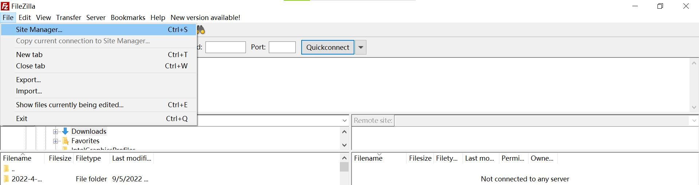
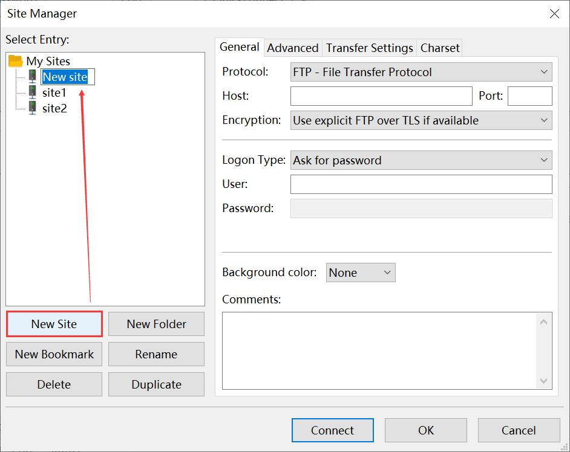
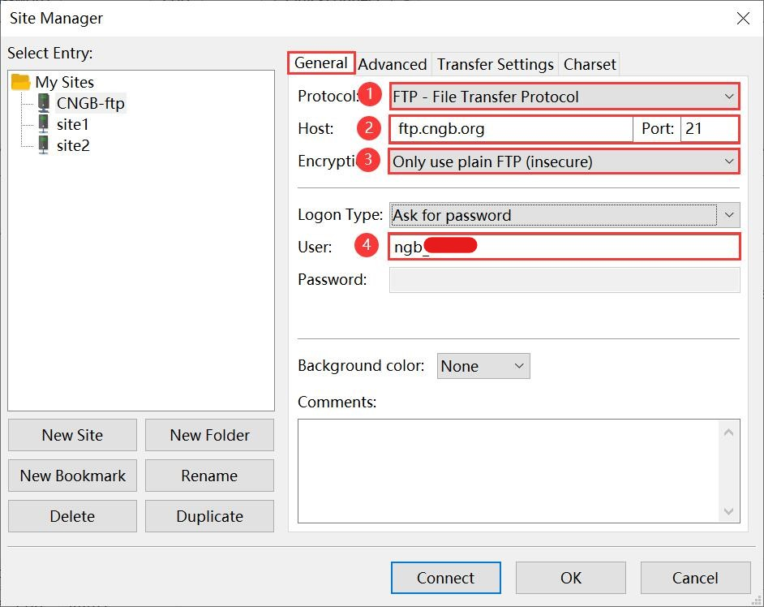
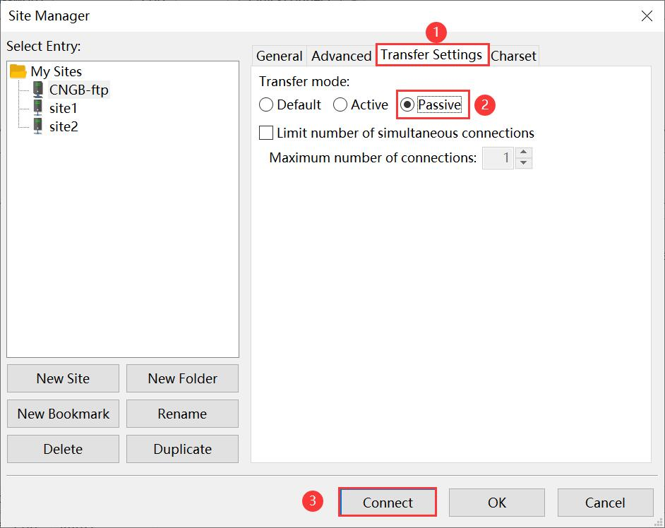
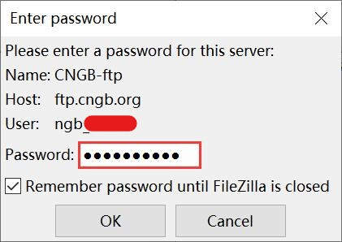
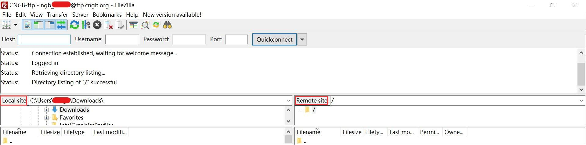

File Transfer Protocol (FTP)
============================

.. tip::

   - Please use passive & binary modes when transferring files.
   - The FTP server is a temporary storage space. Files will be moved to an internal location for archive and assigning of accessions.
   - Files deposited on the FTP site are not displayed under 'My Submissions' on the web interface. The web interface only displays accessioned submissions.
   - You must submit the metadata on the web interface. If no metadata is submitted within two months, the data files will be automatically deleted.

Using third party FTP clients
-----------------------------

Many reliable **FTP clients** can be found on Internet. For example, `Filezilla <https://filezilla-project.org/download.php?type=client>`_. Please refer to its documentation for usage instructions and troubleshooting tips.

1. Open Filezilla after installation. Register a new site, and rename it, such as "CNGB-ftp".

2.Some configuration is required before use.

.. important::

   - The host (ftp.cngb.org), username (ngb\_\*\*\*\*\*), password can be found at https://db.cngb.org/mycngbdb/services, which is assigned by default.

3.After successful connection, You can now transfer files by dragging your folder containing all submission files from the 'Local site' window and dropping into your personalized upload space ('Remote site' window).

The use of Filezilla in **Windows** and **Mac OS** is similar,and you can refer to the above steps.

Using FTP command to transfer files
-----------------------------------

**FTP command** can be executed in **Linux/Unix**, **Mac OS Terminal**.

.. code:: Linux

  # Establish FTP connection
  ftp ftp.cngb.org

  # Go to the local directory containing your submission files
  lcd local_path_to_your_files

  # Use the put command to place one file (or mput for multiple files) into the FTP directory
  put file_name
  mput *

other commands you may use:

.. code:: Linux

  ls # to list the names of the files in the current remote directory

  mkdir # to make a new directory within the current remote directory

  cd # to change directory on the remote machine

  pwd # to find out the pathname of the current directory on the remote machine

  rmdir # to remove (delete) a directory in the current remote directory

  delete # to delete (remove) a file in the current remote directory (same as ``rm`` in UNIX)

  quit # to exit the FTP environment (same as ``bye``)
